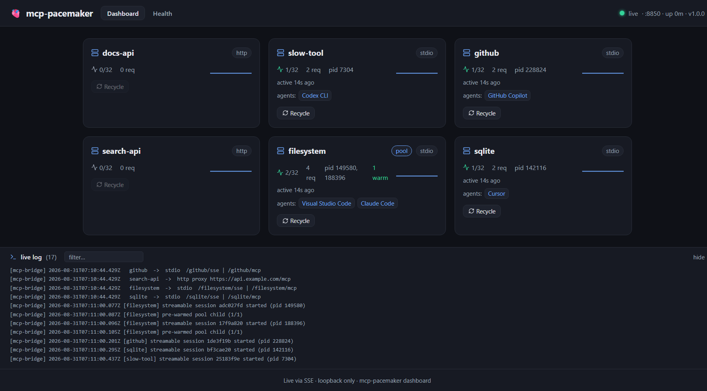
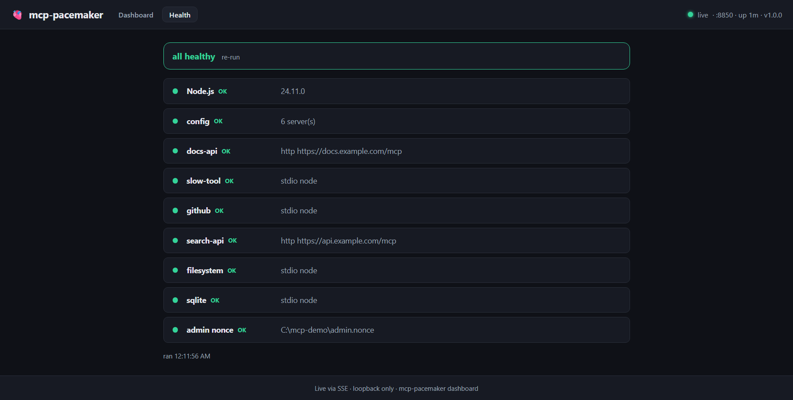

# mcp-pacemaker

**Keep your MCP servers alive across editor restarts, reboots, and token expiry.** The long-running bridge is dependency-free; a small CLI (commander · clack · picocolors) handles setup.

MCP hosts — editors (VS Code, Cursor, Claude Desktop) **and** CLIs (Claude Code, Copilot CLI,
Codex, Gemini) — run stdio MCP servers as child processes. When the host restarts, crashes, or
exits (every one-shot CLI run), **those servers die**. `mcp-pacemaker` runs your servers as
children of a small, long-lived bridge and exposes each over the MCP HTTP+SSE / Streamable HTTP
transport, so every host just **reconnects** — and **multiple hosts share the same warm,
authenticated servers**. Wire them all to one bridge, or give each its own.
A cross-platform supervisor + OS auto-start keep the bridge itself alive across reboots and
sleep/wake, and a pluggable auth layer injects a fresh token per request for HTTP servers.

Sessions also survive **the bridge's own** restart: a client that reconnects with the session id
it already holds is transparently re-established against a freshly started server, so upgrading,
recycling or reaping a server never strands a connected client.

## Quick start

```bash
npm i -g github:girishkvs/mcp-pacemaker
mcp-pacemaker init
```

That one command does the whole setup:

1. **detects** every MCP host you have installed — editors and CLIs,
2. **imports** the servers already configured in them into `~/.mcp-pacemaker/servers.json`,
3. **rewrites** each host's config to point at the bridge (backing every file up first),
4. **registers** OS auto-start so the bridge returns after a reboot,
5. **starts** the bridge and prints what it wired.

Nothing is written before you see it: `mcp-pacemaker plan --client <host>` shows the exact
changes, every config write leaves a `.bak`, and `mcp-pacemaker uninstall` restores them.

After setup, bare `mcp-pacemaker` reports status:

```bash
mcp-pacemaker            # status: bridges, wired hosts, servers
mcp-pacemaker top        # live terminal dashboard
mcp-pacemaker doctor     # diagnose config, reachability, wiring
```

<details>
<summary>Prefer to drive it yourself? The same steps, one at a time</summary>

Every command takes any host id — `vscode`, `cursor`, `claude`, `claude-code`, `copilot-cli`,
`codex`, `gemini` (see [Supported hosts](#supported-hosts)). `--from` / `--client` below are
just examples; substitute whichever you use.

```bash
mcp-pacemaker import  --from <host>            # build servers.json from an existing host
mcp-pacemaker plan    --client <host>          # dry run: show what install would change
mcp-pacemaker install --client <host>          # wire one host (--port N gives it its own bridge)
mcp-pacemaker start                            # start the bridge
```

```bash
# e.g. import from Cursor, then wire three hosts to the same bridge
mcp-pacemaker import  --from cursor
mcp-pacemaker install --client cursor
mcp-pacemaker install --client claude-code
mcp-pacemaker install --client gemini
```

Run `install` once per host you want wired; repeat with `--port N` instead to give a host its
own bridge. `emit` prints the config entries without writing anything, if you'd rather paste
them in.

</details>

## Why not just use supergateway / mcp-proxy?

Those are great, mature stdio↔SSE bridges. `mcp-pacemaker` targets a different problem —
*durable local hosting on a dev workstation* — and adds things they don't:

| | supergateway | mcp-proxy | **mcp-pacemaker** |
|---|---|---|---|
| stdio → SSE | ✅ | ✅ | ✅ |
| Streamable HTTP | ✅ | ✅ | ✅ |
| Dependencies | npm tree | PyPI tree | **bridge: zero** · tiny setup CLI |
| Process supervision | ❌ | ❌ | ✅ |
| OS auto-start (logon / unlock / boot) | ❌ | ❌ | ✅ (Windows / macOS / Linux) |
| Dynamic per-request token (from a CLI, auto-refresh) | ❌ (static) | ❌ (static/OAuth2) | ✅ |
| Sessions survive the bridge restarting | ❌ | ❌ | ✅ |
| Scheduled recycle for interactively-authenticated servers | ❌ | ❌ | ✅ |
| One-command import + client wiring | ❌ | ❌ | ✅ |
| Web + terminal dashboard, HTTP API | ❌ | ❌ | ✅ |

## Supported hosts

Editors and CLIs are auto-detected and wired to the bridge. Most hosts get Streamable HTTP
(`/<name>/mcp`); Cursor and Claude Desktop are wired over SSE (`/<name>/sse`) until Streamable
HTTP is verified there. The bridge centralizes auth, so hosts talk to it unauthenticated over
loopback.

| Host | Type | Config | Wiring | Transport |
|---|---|---|---|---|
| VS Code | editor | `Code/User/mcp.json` | direct edit | Streamable HTTP |
| Cursor | editor | `~/.cursor/mcp.json` | direct edit | SSE |
| Claude Desktop | editor | `claude_desktop_config.json` | direct edit | SSE |
| Claude Code | CLI | `~/.claude.json` | native `claude mcp add` | Streamable HTTP |
| Copilot CLI | CLI | `~/.copilot/mcp-config.json` | direct edit | Streamable HTTP |
| Codex CLI | CLI | `~/.codex/config.toml` | TOML (comment-preserving) | Streamable HTTP |
| Gemini CLI | CLI | `~/.gemini/settings.json` | direct edit | Streamable HTTP |

**Topologies:** wire every host to one shared bridge (default), or give each host its own bridge
(`install --client X --port N`) — or any mix. `status`/`doctor` report all bridges + wired hosts.

## Install

Requires **Node.js ≥ 20**. The bridge is dependency-free; the CLI uses `commander` +
`@clack/prompts` + `picocolors`. **No npm-registry publish needed** — it installs straight from GitHub:

```bash
npm i -g github:girishkvs/mcp-pacemaker # global install -> `mcp-pacemaker` on PATH
# or run without installing:   npx github:girishkvs/mcp-pacemaker <command>
# or clone + run:              git clone https://github.com/girishkvs/mcp-pacemaker && node mcp-pacemaker/bin/cli.mjs <command>
```

### Command reference

| Command | What it does |
|---|---|
| `init [--client a,b] [--yes]` | **The one you want.** Detect hosts, import, wire, auto-start, launch |
| `status` | Bridges, wired hosts, servers. Also what bare `mcp-pacemaker` shows once installed |
| `doctor` | Diagnose config, bridge reachability, host wiring |
| `top` / `dashboard` | Live terminal UI / web dashboard |
| `plan --client <host>` | Dry run — show exactly what `install` would change |
| `import --from <host>` | Build `~/.mcp-pacemaker/servers.json` from an existing host |
| `install --client <host> [--port N]` | Wire one host (its own `--port` gives it its own bridge) |
| `emit --client <host>` | Print the config entries without writing anything |
| `start` / `stop` | Start or stop bridges (`--port` for one, else all) |
| `upgrade [--self]` | Re-wire hosts from `servers.json`; `--self` updates the CLI |
| `update-check [--json]` | Check npm for a newer version |
| `uninstall` | Stop the bridge, remove auto-start, restore configs from `.bak` |

> Publishing to npm later is **optional** — it only shortens `npx github:girishkvs/mcp-pacemaker` to
> `npx mcp-pacemaker` and lists the package on npmjs.com.

> On start, pacemaker **probes the port**: it *adopts* an existing pacemaker bridge and *refuses to collide* with a foreign service (the wizard offers another port).

Each stdio server is exposed over **both** the HTTP+SSE transport (`/<name>/sse`) and the newer
**Streamable HTTP** transport (`/<name>/mcp`), so old and new clients both work.

`install` writes a `.bak` of your client config before touching it, and `uninstall` restores it.

## Dashboards

Two views of the same live state. Neither is required — the bridge runs headless — but both are
useful for answering "is this server actually up, and who is using it?"

### Web dashboard

`mcp-pacemaker dashboard`, or open `http://127.0.0.1:<port>/ui`. It streams over SSE, so it
updates on its own without polling or a refresh.



Per server it shows the transport (`stdio` / `http`), the sharing policy (`pool` when pre-warming),
live sessions against the cap, request count, the actual OS pids, the warm-pool count, how long
ago it was last used, and **which clients are connected** — above, one server is shared by
VS Code and Claude Code while others are held by Copilot, Cursor and Codex. `Recycle` restarts
that server's processes; it is disabled for servers with no session to restart. The live log at
the bottom is the bridge's own log, filterable.

### Health

The `Health` tab runs the same checks as `mcp-pacemaker doctor`, so you can see them without a
terminal.



It checks the Node version, that the config parses, every server definition (including a stdio
server whose relative path will not resolve from the directory it would run in — a failure that
is otherwise silent until a client first calls it), and that the admin nonce file exists.

### Terminal dashboard

`mcp-pacemaker top` is the same data as an Ink TUI, for when a browser is inconvenient:

```
🫀 mcp-pacemaker top                                     ● :8850 · up 176s · v1.0.0
SERVER            TYPE   SESS  WARM  REQ    PID       TOKEN   ERROR / CLIENTS
filesystem        stdio  2     1/1   8      186276,12 -       ⇄ Visual Studio Code,Claude Code
github            stdio  1     -     2      146436    -       ⇄ GitHub Copilot
sqlite            stdio  1     -     2      102108    -       ⇄ Cursor
slow-tool         stdio  1     -     2      103776    -       ⇄ Codex CLI
search-api        http   0     -     0      -         42m
docs-api          http   0     -     0      -         -
↑↓ select · r recycle · q quit
```

`WARM` shows `warm/minWarm` for pooled servers and `-` for the rest, `TOKEN` the time left on a
cached credential, and the last column either the connected clients or the last error. `↑↓`
selects a row and `r` recycles it.

## HTTP API

Everything the dashboards show is plain HTTP on the same loopback port, so you can script it.
Read endpoints need no auth; the one state-changing endpoint requires a nonce.

| Endpoint | Method | Returns |
|---|---|---|
| `/status` | GET | Tiny liveness probe: `ok`, `service`, `version`, `port` and the server names. Used to tell a pacemaker bridge apart from a foreign service on the same port |
| `/api/status` | GET | Full snapshot — every server with sessions, pids, warm count, request count, `lastError`, connected clients |
| `/api/doctor` | GET | The health checks, as JSON |
| `/api/events` | GET (SSE) | The same snapshot pushed every 2s — what the dashboard consumes |
| `/api/logs` | GET (SSE) | Bridge log: replays the last 100 lines, then streams |
| `/admin/recycle/<name>` | POST | Restart a server's processes. Omit `<name>` to recycle everything |
| `/<name>/mcp` | POST/GET/DELETE | Streamable HTTP transport for that server |
| `/<name>/sse` | GET | HTTP+SSE transport for that server |
| `/.well-known/oauth-protected-resource/<name>` | GET | OAuth discovery relayed from the upstream, for HTTP servers where the client authenticates |

```bash
# is a server actually running, and who is using it?
curl -s http://127.0.0.1:8850/api/status | jq '.servers[] | {name, sessions, pids, clients}'

# watch the bridge log
curl -N http://127.0.0.1:8850/api/logs

# force a restart of one server (nonce is written next to servers.json)
curl -X POST http://127.0.0.1:8850/admin/recycle/filesystem \
  -H "x-mcp-nonce: $(cat ~/.mcp-pacemaker/admin.nonce)"
```

`/admin/*` is guarded twice: the request must arrive on loopback, **and** carry the nonce that the
bridge writes to `admin.nonce` next to your config at startup. The nonce is new on every start, so
only same-box tooling that can read that file — the CLI, and the dashboard the bridge itself
served — can change anything.

## servers.json

Config lives at `~/.mcp-pacemaker/servers.json`. `import` fills it from your existing client
config and **carries over `audience`/`auth`/`headers`**, so HTTP servers usually need no hand-editing.
See [`examples/servers.example.json`](examples/servers.example.json).

```jsonc
{
  "filesystem": { "command": "npx", "args": ["-y", "@modelcontextprotocol/server-filesystem", "."] },

  "my-api": {
    "type": "http",
    "url": "https://my-service.example.com/mcp",
    "auth": { "type": "command", "command": "my-cli print-token", "refreshMinutes": 50 }
  }
}
```

**Auth options** (per HTTP server):

| `auth.type` | Behavior |
|---|---|
| `command` | Runs any command that prints a token on stdout; the result is cached and auto-refreshed (`refreshMinutes`). Provider-agnostic — see below. |
| `env` | Uses `process.env[var]`. |
| `static` | Fixed `header` + `value`. |
| `none` | No header is added — the **client** authenticates, and the bridge relays OAuth discovery and challenges for it. |

`auth.type: "command"` is deliberately just "run this and use what it prints", so it works with
whatever issues tokens in your environment. Some examples — none of these are special-cased:

```jsonc
// Azure
{ "type": "command", "command": "az account get-access-token --resource api://<id> --query accessToken -o tsv" }
// Google Cloud
{ "type": "command", "command": "gcloud auth print-access-token" }
// AWS (e.g. a signed token from your own helper)
{ "type": "command", "command": "aws-token-helper --profile prod" }
// HashiCorp Vault
{ "type": "command", "command": "vault read -field=token secret/my-api" }
// 1Password / any secret manager
{ "type": "command", "command": "op read op://vault/my-api/token" }
// A plain script
{ "type": "command", "command": "./scripts/get-token.sh" }
```

By default the token is sent as `Authorization: Bearer <token>`; set `header` to send it
somewhere else (for example `{ "header": "X-Api-Key" }`).

> **Azure shorthand.** A bare `"audience": "<res>"` expands to
> `az account get-access-token --resource <res> …`. That is a convenience for Azure users only —
> every other provider uses `auth.command` above.

## Security

- The bridge binds **`127.0.0.1` only** (local loopback) — not reachable off-box.
- Tokens are **minted from your own already-authenticated CLI** and cached in memory; **never written to disk**.
- The **bridge** (the process that runs 24/7) has **zero third-party dependencies**; the setup CLI uses `commander` / `@clack/prompts` / `picocolors` / `smol-toml`, and the TUI adds `ink` / `react`.

## Multi-agent & resource controls

Multiple hosts/agents can share one bridge — each gets its own isolated session (no cross-talk),
and HTTP servers share the cached token across all of them. The dashboard, `top`, and
`mcp-pacemaker status` show **which agents are connected** to each server.

| Control | Env / config | Default | Effect |
|---|---|---|---|
| Idle reaper | `MCP_IDLE_TIMEOUT_MS` | `1800000` (30 min) | free Streamable HTTP children idle past the timeout. Safe by default because a returning client's session is transparently re-established. `0` disables |
| Concurrency cap | `MCP_MAX_SESSIONS_PER_SERVER`, or per-server `maxSessions` | `0` (unlimited) | reject new sessions past the cap (HTTP 503) |
| Queue at the cap | `MCP_QUEUE_TIMEOUT_MS` | `10000` (10s) | at the cap, wait this long for a slot before returning 503, so a burst is absorbed rather than failed. `0` rejects immediately |
| Sharing policy | per-server `sharing` (+ `minWarm`) | `isolated` | `isolated` = one child per session; `pool` pre-warms `minWarm` un-initialized children so a new session adopts a warm one. Worth it for servers with a slow cold start |
| Session resume | `MCP_RESUME`, `MCP_RESUME_TTL_MS` | on, 24h | re-establish a session id the bridge has not seen — after a restart, recycle or idle reap. `MCP_RESUME=0` disables |
| Scheduled recycle | per-server `recycleMinutes`, or `MCP_RECYCLE_MINUTES` | off | restart a server periodically, for servers holding a credential they can only refresh interactively |
| Request timeouts | `MCP_REQUEST_TIMEOUT_MS` / `MCP_INIT_TIMEOUT_MS` | 30s / 180s | `initialize` also pays for spawning the server, so it gets a longer budget than ordinary calls |
| Credential refresh | `MCP_TOKEN_REFRESH_LEAD_MS` | `300000` (5 min) | renew a cached token before it expires instead of discovering the expiry on a request |

## Uninstall

```bash
npx mcp-pacemaker uninstall   # stop bridge, remove auto-start, restore client config from .bak
```

## Project

- [CHANGELOG.md](CHANGELOG.md) — release notes
- [CONTRIBUTING.md](CONTRIBUTING.md) — development setup and how regression tests are expected to be proven
- [SECURITY.md](SECURITY.md) — threat model and how to report a vulnerability

## License

MIT © Girish Konda
